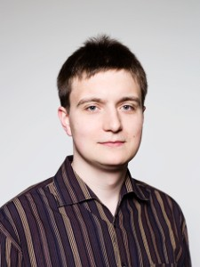

# Teaching Staff

## Lecturers

### Julie Butler

Hi!  My name is Julie and I am a fourth year graduate student at Michigan State University.  Though I now live in East Lansing, Michigan, I am originally from rural South Carolina.  I am a first generation college student and I attended a high school with limited funding and a small college which only offered a small number of physics classes.  These limitations did not stop be from pursuing my dream of becoming a physicist, even though I had to work harder than students who came from backgrounds with more opportunities.  My research in graduate school involves finding ways to use machine learning to speed up nuclear theory calculations, which can take days or weeks to run using only traditional methods.  After graduate school I hope to get a job teaching physics at a small college or university. Please feel free to contact me at butle222@msu.edu.

### Morten Hjorth-Jensen

Hi folks! My name is Morten and I am a theoretical physicist with a strong interest in computational physics and many-body theory in general, and the nuclear many-body problem and nuclear structure problems in particular. This means that I study various methods for solving for example Schrödinger's equation for many interacting particles, spanning from algorithmic aspects to the mathematical properties of such methods. The latter also leads to a strong interest in computational physics as well as computational aspects of quantum mechanical methods ranging from traditional many-body methods to quantum computing and machine learning. I share my time equally between Michigan State University in the US and the University of Oslo, Norway. Feel free to contact me at hjensen@msu.edu.

### Linda Hlophe

Hello there! My name is Linda Hlophe and I am postdoctoral researcher at the Lawrence Livermore National Laboratory (LLNL). I was born and raised in rural Eswatini (formerly Swaziland) in southern Africa where I attended a local high school. Our school was severely under-resourced and we couldn’t even afford physics textbooks. I was fortunate to be the only student from my class to be admitted to the university of Eswatini (the only university at the time), majoring in Physics and Chemistry. After graduating in 2010 I started my graduate studies at Ohio University which I completed in 2016. Thereafter I got a postdoctoral appointment at Michigan State University (MSU) which ended in 2020 before starting my current position. I specialize on the theoretical description of nuclear reactions using few-body methods in conjunction with a first-principles approach to nuclear structure. I primarily simulate reactions between exotic atomic nuclei (particularly those create in supernova explosions or neutron-star mergers) by solving, e.g.,  the Schrodinger equation for three interacting particles that are not bound together. This is generally an intensive computationally task requiring advanced methods for numerically solving differential and integral equations. Feel free to contact me at hlophe1@llnl.gov. 

## Teaching Assistants (In-Class and Slack)

### Christian Drischler

Hi, my name is Christian! I joined Michigan State University in October 2020 as FRIB Theory Fellow. Prior to that I was a postdoctoral Humboldt Fellow at University of California,
Berkeley. In 2017 I graduated from Technical University Darmstadt, Germany, with a doctoral degree in physics. My research interests include the study of strongly interacting matter under the extreme conditions present in neutron stars. Neutron stars are among the densest objects in the observable Universe, only second to black holes. Some of the tools used in this research are: effective field theory, Bayesian methods, automated code generation, and high-performance computing.

### Jane Kim

Hi, my name is Jane! I was born and raised in Anchorage, Alaska, but I’ve been at Michigan State University for the past seven years as an undergraduate and a graduate student. Halfway through my undergraduate studies in physics and math, I was introduced to programming. Suddenly, I could solve problems that I couldn’t even dream about solving by hand! This made me want to develop this skill even further, so I am now working on a dual PhD in physics and computational math, science, and engineering (CMSE). My research involves using machine learning to solve quantum many-body problems, with a focus on neural networks and variational Monte Carlo.

### Kang Yu
### Yani Udiani

I am a soon to be fifth year PhD student (😥) working on the development and improvement of ab-initio calculations for neutron star equations of state. My hobbies include writing music, playing chess, and wondering what I'm doing with my life :)  I look forward to meeting you guys.
